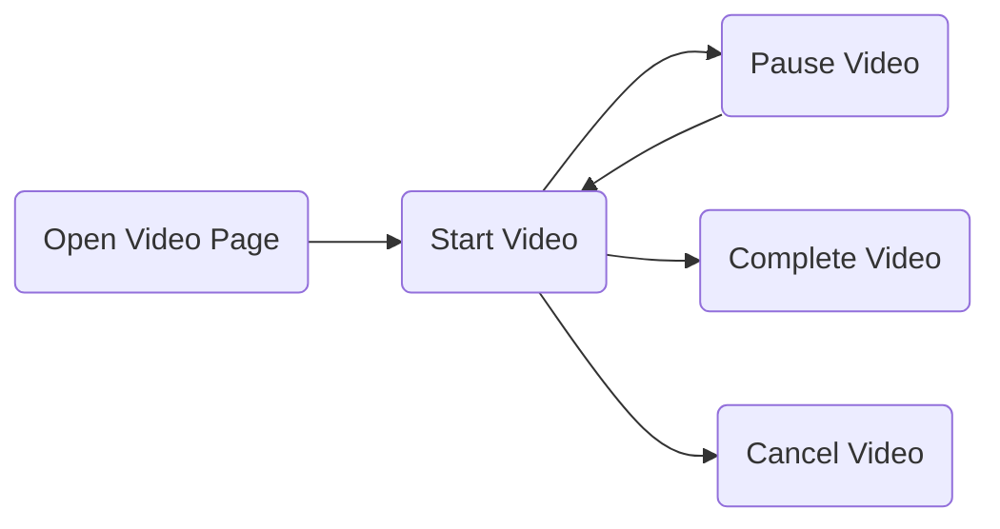
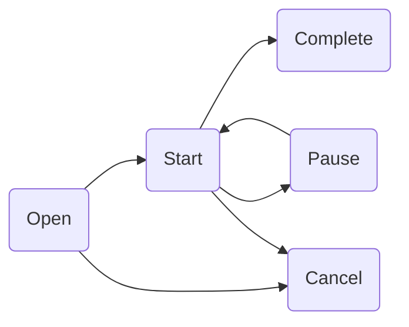

# Tentacles

# What is Tentacles?

Tentacles are body parts that an animal uses to hold, grab or even feel things. That is what Tentacles should be used for in terms of your data collection in your application. It should help you structuring your events and abstracting your analytics from specific providers.

When starting to build an app we often start only with collecting a few events and send these events to a service like Firebase Analytics. After a while we incrementally add new events and also decide we would like to use Appboy to increase our user engagement. If we have not abstracted our Tracking Layer we now have to add Appboy whereever we log events for Firebase.

For further information why abstracting a third party library make sense [Benoit Pasquier wrote an article](**https://benoitpasquier.com/abstract-ios-third-party-libraries/).

**It also comes with the advantage of testing, as you can just plug in any Analytics provider and not the actual provider implementation to test your events.**

## Reasons for abstracting analytics:

- Replacing Analytics provider
- Adding more Analytics provider
- Testing our Analytics events.
  
## Structuring Events

- Categorisation
- Trigger
- Naming
- Typesafe Attributes

## Value Proposition Activities

[Value proposition](https://en.wikipedia.org/wiki/Value_proposition) is a term borrowed out of Marketing and describes the reason why a customer would choose your product. Applying it to an application, it is the reason why a user would choose to use your app. As data related to the value proposition is especially important, tentacles offers a way to connect events that are related to the same value proposition activity session. A session (identified by UUID) is a period devoted to a particular value proposition activity. The UUID identifying the session is automatically added and managed.

Lets use Youtube as an example, lets simplify and say their value proposition is offering engaging content in particular videos.
To measure this, watching videos is analysed. The user experience of watching a video usually involves these steps:


These steps are the possible statuses of a session related to a value proposition activity. When a ValueProposition is tracked with an action, the status of the session is updated and a event forwarded. Status changes that are allowed:

If a prohibited status update occurs a non fatal error event is forwarded and the status is **not** updated. In cases where attributes are specific to a value proposition status they can be added to the action, i.e. if a pause event needs the pausing point of the video, these attributes are then mapped to the analytics events. With reaching completed or canceled the session ends and it gets removed.

### To Do:
- What happens if the app goes in to background(-> all sessions are completed)
- What happens if the app comes back in to foreground( -> new sessions are created and set to open)

```
struct WatchingVideo: ValueProposition {
    let name: String = "watchingVideo"
    let attribute: AnalyticsEventAttributes
    init(attributes: Attributes) {
    self.attributes = attribute
    }
}
extension WatchingVideo {
    struct Attributes: AnalyticsEventAttributes {
        let videoName: String
        let language: String
        let double: Double // in seconds
    }
}

let attributes = WatchingVideo.Attributes(
    videoName: "Learning Swift",
    language: "English",
    duration: 3240)
let watchingVideo = WatchingVideo(attributes: attributes)
let action = ValuePropositionAction(status: .open, trigger: .clicked)
tracker.track(for: watchingVideo, with: action)
```
There are convenient static functions to build an action e.g.:
```
tracker.track(for: watchingVideo, with: .start())
```
Adding action specific attributes:
```
struct WatchingVideoCompletionAttributes: AnalyticsEventAttributes {
    let secondsSkipped: Double
    let userCommented: Bool
}
let completionAttributes = WatchingVideoCompletionAttributes(
    secondsSkipped: 300, userCommented: false)
tracker.track(for: watchingVideo, with:.complete(trigger: .automatically,
    attributes: completionAttributes))
```
