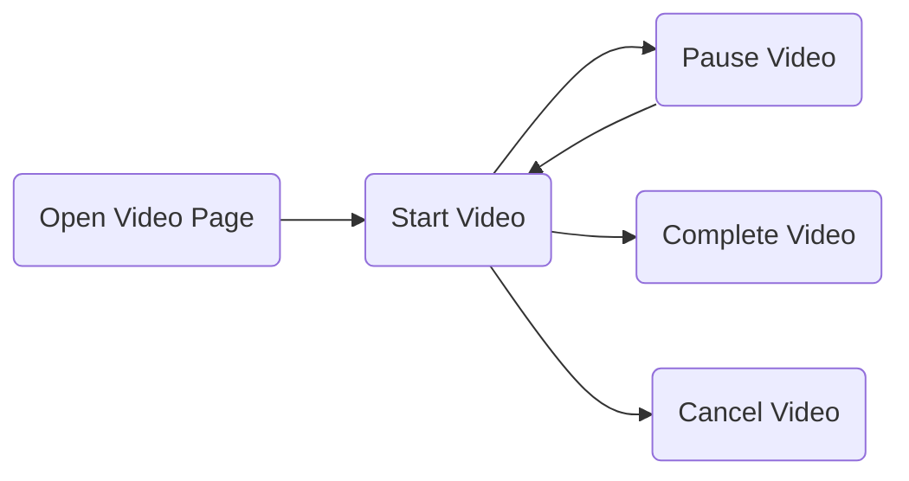
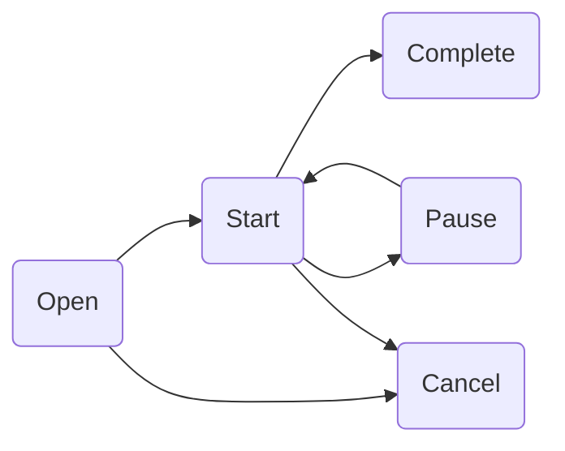

# Tentacles
Current State: ****Work in Progress**** Documentation & Tests started but not done yet, Implementation of first version pretty much done
# What is Tentacles?

Tentacles are body parts that an animal uses to hold, grab or even feel things. That is what Tentacles should be used for in terms of data collection in your application. It should help you to structure analytic events and abstract analytics from specific providers.

When starting to build an app we often start only with collecting a few events and send these events to a service like Firebase Analytics. After a while we incrementally add new events and maybe also decide i.e. we would like to increase our user engagement and therefore add an other service that needs analytics i.e. Appboy. If we haven't abstracted our analytics layer we now have to add Appboy whereever we log events for Firebase. Another reason is the improvement of testing our analytics layer, if it is abstracted we can add a stub and easily test the events.

For further information why abstracting a third party library make sense [Benoit Pasquier wrote an article](https://benoitpasquier.com/abstract-ios-third-party-libraries/).

## Structuring Events
Using 
- Categorisation

- Trigger

- Naming

- Typesafe Attributes

## Analytics setup

 
## Domain driven analytics

When developing an app it is important to understand its domain. Yes we want to track if a user logs in or clicks on a specific button but what we are particular interested is how are users interacting with our core functionalities, the functionalities that should bring the most value to our users. 

[Value proposition](https://en.wikipedia.org/wiki/Value_proposition) is a term borrowed out of marketing and describes the reason why a customer would choose your product. Applying it to an application, it is the reason why a user would choose to use your app. As data related to the value proposition is especially important, tentacles offers a way to connect events that are related to the same value proposition session. 

A session (identified by UUID) is a period devoted to a particular value proposition activity. The UUID identifying the session is automatically added and managed. This brings the advantage of further analysing possibilities of our analytic data, as we can derive connections between the events. As Tentacles tracks every status change of a ValueProposition with a timestamp it is easily possible to calculate the duration between i.e. when the value proposition started and completed. 
 

Lets use Youtube as an example, lets simplify and say their value proposition is offering engaging content in particular videos.
To measure this, watching videos is analysed. The user experience of watching a video usually involves these steps:

These steps are the possible statuses of a session related to a value proposition activity. When a ValueProposition is tracked with an action, the status of the session is updated and a event forwarded. Status changes that are allowed:


If a prohibited status update occurs a non fatal error event is forwarded and the status is ****not**** updated. In cases where attributes are specific to a value proposition status they can be added to the action. I.e. if a pause event needs the pausing point of the video, these attributes are then mapped to the analytics events. With reaching completed or canceled the session ends and it gets removed.

### To Do:

- What happens if the app goes in to background(-> all sessions are completed)

- What happens if the app comes back in to foreground( -> new sessions are created and set to open)
- More than one session of the same value proposition?

```
struct WatchingVideo: ValueProposition {
    let name: String = "watchingVideo"
    let attribute: AnalyticsEventAttributes
    init(attributes: Attributes) {
        self.attributes = attribute
    }
}

extension WatchingVideo {
    struct Attributes: AnalyticsEventAttributes {
        let videoName: String
        let language: String
        let double: Double // in seconds
    }
}

let attributes = WatchingVideo.Attributes(
    videoName: "Learning Swift",language: "English",duration: 3240)
let watchingVideo = WatchingVideo(attributes: attributes)
let action = ValuePropositionAction(status: .open, trigger: .clicked)
tracker.track(for: watchingVideo, with: action)
```

There are convenient static functions to build an action e.g.:

```
tracker.track(for: watchingVideo, with: .start())
```

Adding action specific attributes:

```
struct WatchingVideoCompletionAttributes: AnalyticsEventAttributes {
    let secondsSkipped: Double
    let userCommented: Bool
}

let completionAttributes = WatchingVideoCompletionAttributes(
    secondsSkipped: 300, userCommented: false)
tracker.track(for: watchingVideo, with:.complete(trigger: .automatically,attributes: completionAttributes))
```

## Default attributes
Attributes added to every event by default:

- sessionId - A generated random uuid, to let you search events from the same session.

Attributes added to ValueProposition events:

- trigger, activity triggering the event, specified by the app
- category - value: **valueProposition**
- status - status of the value proposition session, possible values: **opened, started, paused, canceled, completed**
- valuePropositionSessionId - A generated random uuid, to let you search events from the same value proposition session.
- with every status update of a session a timestamp of the update is logged: i.e. open: 123456.00, start: 1234567.00, completed: 1234354.00, if an update occurs more than once a count is added as suffix the key: i.e. start_1, start_2
