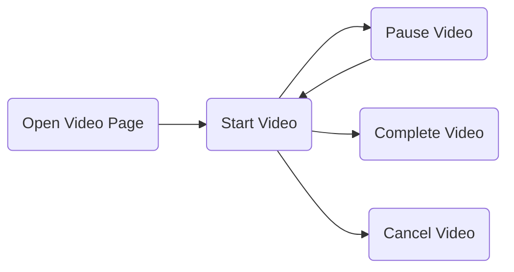
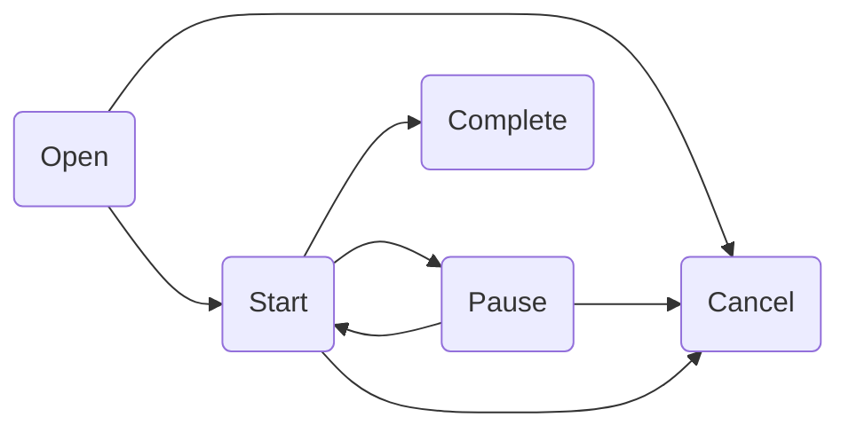

# 🐙Tentacles
Current State: ****Work in Progress**** Documentation & Tests started but not done yet, Implementation of first version pretty much done
# Welcome to Tentacles

Tentacles are body parts that an animal uses to hold, grab or even feel things. That is what Tentacles is used for in terms of data collection in your application. It helps you to abstract analytics from specific providers, to structure your analytic events in a typesafe way and to collect meaning full domain-driven data with ValueProposition.

For further information why abstracting a third party library make sense [Benoit Pasquier wrote an article](https://benoitpasquier.com/abstract-ios-third-party-libraries/).

## ✨Features
- Abstracting analytics layer
    - Analytics event reporting
    - Error reporting
    - Adding user attributes
- Typesafety for events and no manual data converting between event layers
- Domain-driven analytics with ValueProposition
- Middleware to transform/ignore events for reporters


## Analytics setup
Tentacles registers and manages AnalyticsReporter in a central entity. If we want to use a service like Firebase we need to great an implementation that conforms to AnalyticsReporting:

```swift
class FirebaseReporter: AnalyticsReporting {
    func setup() {
        FirebaseApp.configure()
    }
    func report(event: RawAnalyticsEvent) {
        Analytics.logEvent(event.name, parameters: event.attributes)
    }
    func addUserAttributes(_ attributes: AttributesValue) {
        attributes.forEach { (key, value) in
            Analytics.setUserProperty(value as? String, forName: key)
        }
    }
    func identify(with id: String) {
        Analytics.setUserID(id)
    }
    func logout() {
        Analytics.resetAnalyticsData()
    }
    func report(_ error: Error, filename: String, line: Int) {
    }
}
```
Registering reporters to Tentacles is easy:
```swift
let firebaseReporter = FirebaseReporter()
let tentacles = Tentacles()
tentacles.register(analyticsReporter: firebaseReporter)
```
In the case where we want to register a Middleware to affect events going to all of our reporters:
```swift
tentacles.register(.capitalisedAttributeKeys)
```
Of if we want to add a Middleware only affecting events for a specific reporter:
```swift
tentacles.register(analyticsReporter: firebaseReporter, middlewares: [.ignoreLifecycleEvents])
```

## Defining Events & Using Analytics
Creating analytic events and attributes is easy and type safe.
Defining Attributes:
```swift
struct UserContentSharingAttributes: TentaclesAttributes {
        enum Content: Encodable {
            case video
            case picture
            case story
        } 
        let content: Content
        let likedContent: Bool
        let commentedOnContent: Bool
    }
}
```
Adding your own custom AnalyticsEventCategory :
```swift
enum MyAppAnalyticsEventCategory:String, AnalyticsEventCategory {
    case social
    var name: String {
        self.rawValue
    }
}
``` 
Defining AnalyticsEvent:
```swift

```
```swift
typealias UserContentSharing = AnalyticsEvent<UserContentSharingAttributes>
extension UserContentSharing {
    init(name: String = "userContentSharing",
         category: AnalyticsEventCategory = MyAppAnalyticsEventCategory.social,
         trigger: AnalyticsEventTrigger = TentaclesEventTrigger.clicked,
         otherAttributes: UserContentSharingAttributes) {
         self.init(category: category, trigger: trigger,
                   name: name, otherAttributes: otherAttributes)
    }
}
let userContentSharingAttributes = UserContentSharingAttributes(
content: .video, didUserLikeContent: true, didUserComment: false)
let userSharedContentEvent = UserContentSharing(otherAttributes: userContentSharingAttributes)
tentacles.track(userSharedContentEvent)
```
Defining and tracking a screen event:
```swift
typealias  AnalyticsScreenEvent = AnalyticsEvent<EmptyAttributes>
extension AnalyticsScreenEvent {
    init(name: String) {
        self.init(category: TentaclesEventCategory.screen,
                  trigger: TentaclesEventTrigger.screenDidAppear,
                  name: name,
                  otherAttributes: EmptyAttributes())
    }
}
let screenEvent = AnalyticsScreenEvent(name: "Home Screen")
tentacles.track(screenEvent)
```
Tracking an error is also possible:
```swift
tentacles.report(error)
```
Our Firebase analytice implementation does not support reporting errors, therefore this would not report anything. We would need to add a AnalyticsReporting implementation for a service like Crashlytics, it is the same process as described above for Firebase analytics.

In a case where no attributes need to be reported, EmptyAttributes must be used.
## Domain driven analytics

When developing an app it is important to understand its domain. Yes, we want to track if a user logs in or clicks on a specific button, but what we are particular interested is how are users interacting with the core functionalities, the functionalities that should bring the most value to our users. 

[Value proposition](https://en.wikipedia.org/wiki/Value_proposition) is a term borrowed out of marketing and describes the reason why a customer would choose your product. Applying it to an application, it is the reason why a user would choose to use your app. As data related to the value proposition is especially important, Tentacles offers a way to connect events that are related to the same value proposition session. 

A session (identified by UUID) is a period devoted to a particular value proposition activity. The UUID identifying the session is automatically added and managed. This brings the advantage of further possibilities to analyse the data, as connections between the events can be derived. For example as Tentacles tracks every status change of a ValueProposition with a timestamp it is easily possible to calculate the duration between the value proposition started and completed. 
 
Lets use Youtube as an example, lets simplify and say their value proposition is offering engaging content, in particular videos.
To measure this, watching videos is analysed. The user experience of watching a video usually involves these steps:

These steps are the possible status of a session related to a value proposition activity. When a ValueProposition is tracked with an action, the status of the session is updated and a event forwarded. Status changes that are allowed:


By reaching completed or canceled the session ends and it gets deallocated. 
If a prohibited status update occurs a non fatal error event is forwarded and the status is **not** updated. In cases where attributes are specific to a value proposition status they can be added to the action. I.e. if a pause event needs the pausing point of the video, these attributes are then mapped to the analytics events. 

Multiple sessions with different ValuePropositions can be managed. However, only one session for one particular ValueProposition. A ValueProposition is equal if name and attributes match, not considering additional attributes that can be added by ValuePropositionAction. 

### Background & Foreground Applifecycle
When the app **will resign**, all active value proposition sessions are canceled and cached in memory in case the app enters foreground again. After app **did become active** again, all previous active sessions are reset and updated with a new identifier. For all previous active sessions an open event is sent and then reset to the previous status that also triggers an event.

### Defining & Tracking Value Propositions 

```swift
struct WatchingVideo: ValueProposition {
    let name: String = "watchingVideo"
    let attributes: Attributes
    init(attributes: Attributes) {
        self.attributes = attributes
    }
}

extension WatchingVideo {
    struct Attributes: TentaclesAttributes {
        let videoName: String
        let language: String
        let double: Double // in seconds
    }
}

let attributes = WatchingVideo.Attributes(
    videoName: "Learning Swift", language: "English", duration: 3240)
let watchingVideo = WatchingVideo(attributes: attributes)
let action = ValuePropositionAction(status: .open, trigger: .clicked)
tracker.track(for: watchingVideo, with: action)
```

There are convenient static functions to build an action e.g.:

```swift
tracker.track(for: watchingVideo, with: .start())
```

Adding action specific attributes:

```swift
struct WatchingVideoCompletionAttributes: TentaclesAttributes {
    let secondsSkipped: Double
    let userCommented: Bool
}

let completionAttributes = WatchingVideoCompletionAttributes(
    secondsSkipped: 300, userCommented: false)
tracker.track(for: watchingVideo, with: .complete(trigger: .automatically, attributes: completionAttributes))
```

## Default attributes
CustomAttributes added via TentacleAttributes that share the same same key as default attributes will overwrite default ones.

Attributes added to every event by default:

- sessionId - A generated random uuid, to let you search events from the same session.

Attributes added to ValueProposition events:

- trigger, activity triggering the event, specified by the app
- category - value: **valueProposition**
- status - status of the value proposition session, possible values: 
    - **opened, started, paused, canceled, completed**
- valuePropositionSessionId - A generated random uuid, to let you search events from the same value proposition session.
- with every status update of a session a timestamp of the update is logged:
    -  i.e. opened: 123456.00, started: 1234567.00, completed: 1234354.00,
    -  if an update occurs more than once a count is added as suffix to the key:
        -  i.e. started_1, started_2

## Middleware
Middlewares are used to transform events and can be registered to a specific reporter or as a general Middleware to the AnalyticsRegister. If added to a specific reporter only events reported to this reporter will be transformed. 
Use Cases:

- Transforming Events
    - Editing existing attribute keys or values i.e. capitalising the key or converting it in a different format.
    - Adding new attributes, i.e. calculate the active duration a user spent with a particular value proposition.
- Skipping events, i.e. skip all events for a category for a specific reporter.

### Default Middlewares:
